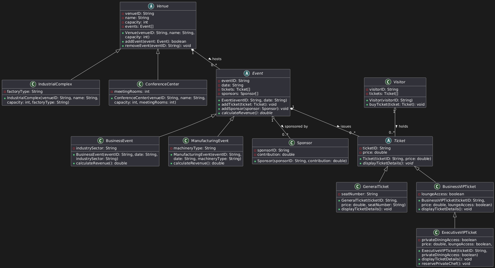
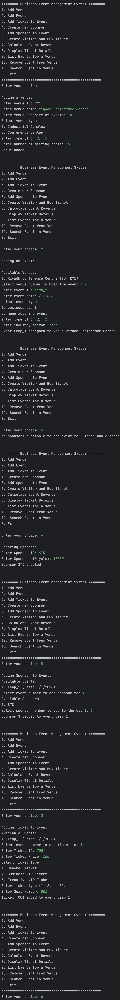
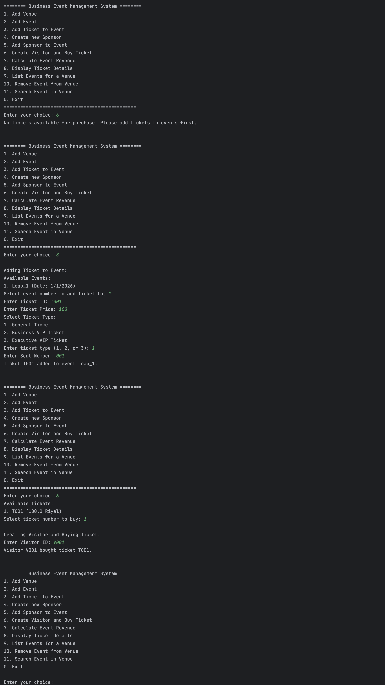
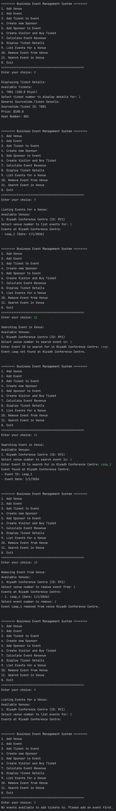

# Business events management system  

## Cover Sheet
- **Project Title**: Business Event Management System
- **Course**: CSC113
- **Student**: Nasser Alowaymir
- **KSU ID number**: 445102817
- **Division number**: 77965

## Introduction
A comprehensive system for managing various types of business events and manufacturing expos. Key features:
- Multiple venue types management
- Multiple tickets system
- Visitors tracking system
- Event sponsorship
- Revenue calculation

## UML Diagram

## Implementation Details

### Abstract Class Venue
- **Attributes**:
  - venueID: Unique identifier
  - name: Venue name
  - capacity: Maximum attendees
  - events: Array of Event objects hosted at this venue.
- **Methods**:
  - Venue(venueID, name, capacity): Base constructor
  - addEvent(event): add an event to the venue's list of events if the venue's capacity is not exceeded by the expected attendees of the new event. Returns `true` if event is added, `false` otherwise.
  - removeEvent(eventID): Removes the specified event from the venue's list of events.

### Class IndustrialComplex (extends Venue)
- **Attributes**:
  - factoryType: Industry specialization
- **Constructor**:
  - IndustrialComplex(venueID, name, capacity, factoryType)

### Class ConferenceCenter (extends Venue)
- **Attributes**:
  - meetingRooms: Number of meeting rooms
- **Constructor**:
  - ConferenceCenter(venueID, name, capacity, meetingRooms)

### Abstract Class Event
- **Attributes**:
  - eventID: Unique event identifier
  - date: Event date
  - tickets: Array of Ticket objects issued for this event.
  - sponsors: Array of Sponsor objects sponsoring this event.
- **Methods**:
  - Event(eventID, date): Base constructor
  - addTicket(ticket): add a ticket to the event's list of tickets.
  - addSponsor(sponsor): add a sponsor to the event's list of sponsors.
  - calculateRevenue(): Abstract method to calculate the revenue generated by the event.

### Class BusinessEvent (extends Event)
- **Attributes**:
  - industrySector: Business domain
- **Constructor**:
  - BusinessEvent(eventID, date, industrySector)
- **Methods**:
  - calculateRevenue(): Calculates revenue as the sum of ticket prices for all tickets sold for this business event.

### Class ManufacturingEvent (extends Event)
- **Attributes**:
  - machineryType: Equipment category
- **Constructor**:
  - ManufacturingEvent(eventID, date, machineryType)
- **Methods**:
  - calculateRevenue(): Calculates revenue as ticket sales revenue minus equipment rental or operational costs associated with the manufacturing event.

### Class Sponsor
- **Attributes**:
  - sponsorID: Unique sponsor ID
  - contribution: Financial support amount
- **Constructor**:
  - Sponsor(sponsorID, contribution)

### Class Visitor
- **Attributes**:
  - visitorID: Unique visitor ID
  - tickets: Array of Ticket objects purchased by this visitor.
- **Constructor**:
  - Visitor(visitorID)
- **Methods**:
  - buyTicket(ticket): add a ticket to the visitor's collection of purchased tickets.

### Abstract Class Ticket
- **Attributes**:
  - ticketID: Unique ticket number
  - price: Ticket cost
- **Constructor**:
  - Ticket(ticketID, price)
- **Methods**:
  - displayTicketDetails(): Abstract method to display specific ticket details.

### Class GeneralTicket (extends Ticket)
- **Attributes**:
  - seatNumber: Assigned seating
- **Constructor**:
  - GeneralTicket(ticketID, price, seatNumber)
- **Methods**:
  - displayTicketDetails(): Displays general ticket details including seat number.

### Class BusinessVIPTicket (extends Ticket)
- **Attributes**:
  - loungeAccess: Lounge availability
- **Constructor**:
  - BusinessVIPTicket(ticketID, price, loungeAccess)
- **Methods**:
  - displayTicketDetails(): Displays business VIP ticket details including lounge access information.

### Class ExecutiveVIPTicket (extends BusinessVIPTicket)
- **Attributes**:
  - privateDiningAccess: Exclusive dining
- **Constructor**:
  - ExecutiveVIPTicket(ticketID, price, loungeAccess, privateDiningAccess)
- **Methods**:
  - displayTicketDetails(): Displays executive VIP ticket details including private dining privileges.
  - reservePrivateChef(): Method to handle the reservation of a private chef for executive VIP ticket holders.

## Source Code
[Download Here](./SourceCode.zip)

## Sample Run

